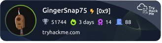
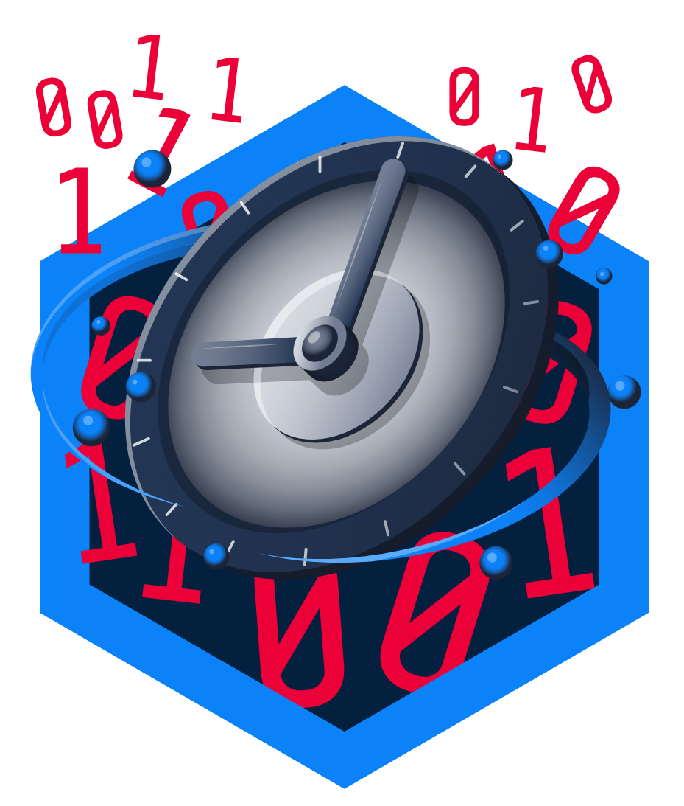
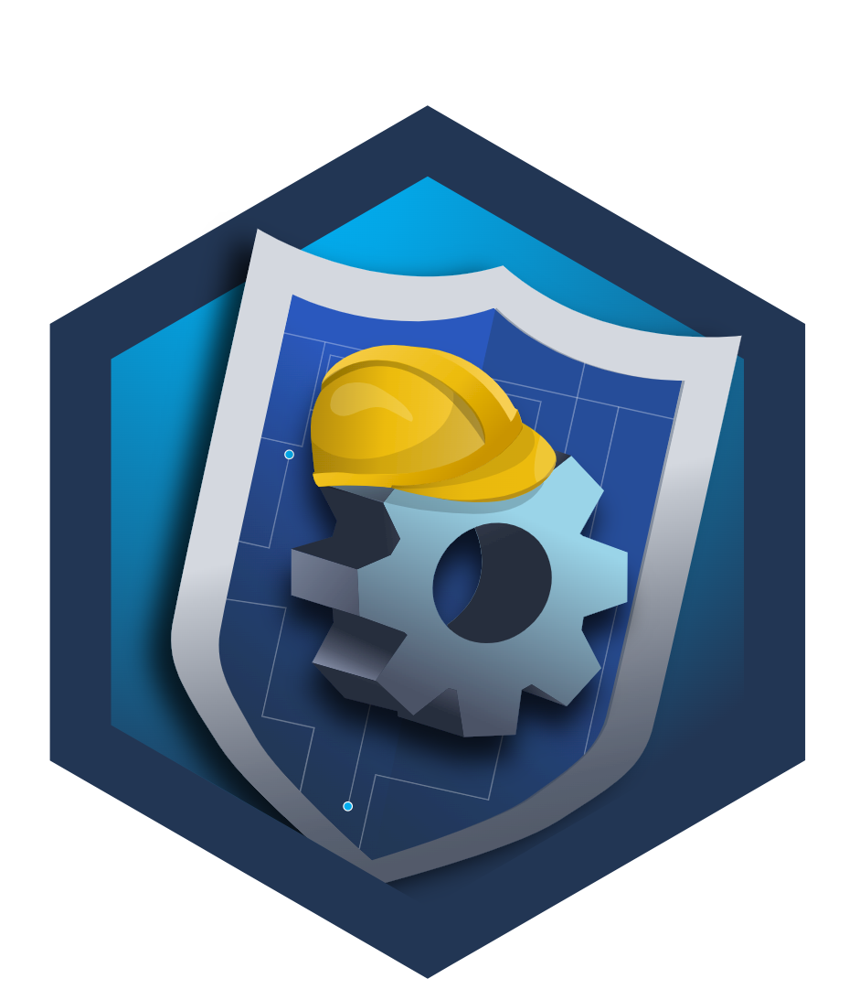
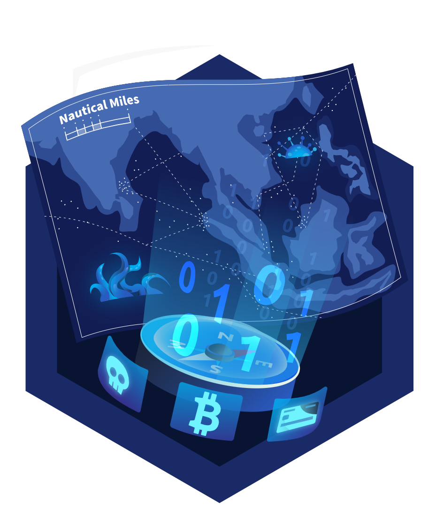
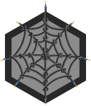

# TryHackMe Badges 

Below are the badges I've earned on TryHackMe, along with descriptions and links to the corresponding rooms or challenges.

## Badges

### Badge 1: Blue

**Description:** Hacking into Windows via EternalBlue

### Badge 2: Burp'ed

**Description:** Completing the Burp Suite module

### Badge 3: cat_linux.txt

**Description:** Being competent in Linux

### Badge 4: Friday Fixer

**Description:** Finishing the Friday Overtime challenge! 

### Badge 5: Introduction to Security Engineering

**Description:** Completed the Security Engineer Intro room!

### Badge 6: Intro to Web Hacking

**Description:** Completing the 'Introduction to Web Hacking' module

### Badge 7: Metasploitable

**Description:** Contains the knowledge to use Metasploit

### Badge 8: Networking Nerd

**Description:** Completing the 'Network Fundamentals' module

### Badge 9: Pentesting Principles

**Description:** Completing the 'Introduction to Pentesting' module

### Badge 10: Skilled Navigator

**Description:** Finishing the Eviction challenge!

### Badge 11: The Course Awakens

**Description:** Finishing the first room in the DevSecOps path!

### Badge 12: Webbed

**Description:** Understands how the world wide web works

### Badge 13: World Wide Web

**Description:** Completing the 'How The Web Works' module

