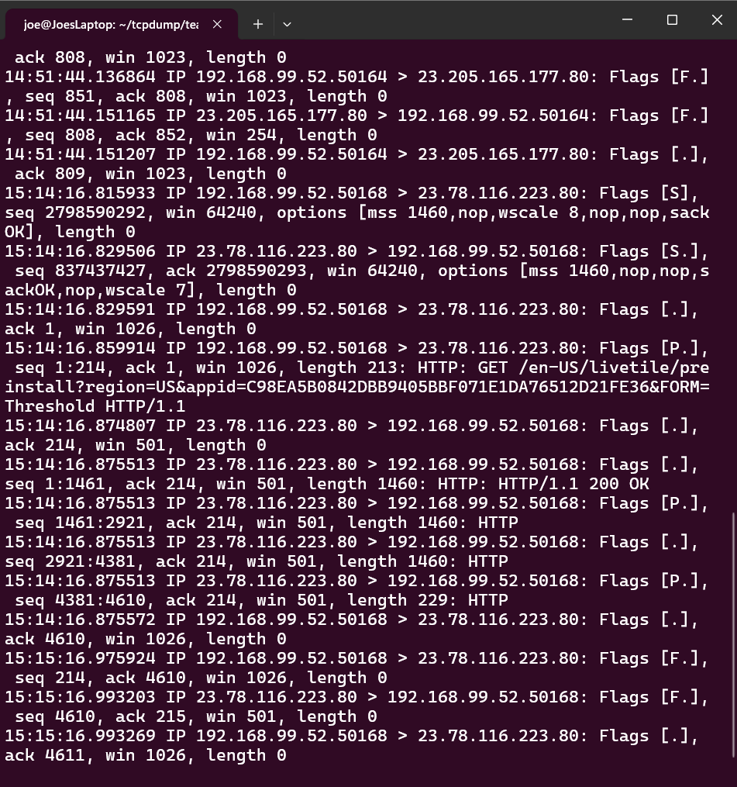

link to project: https://github.com/strandjs/IntroLabs/blob/master/IntroClassFiles/Tools/IntroClass/TCPDump/TCPDump.md

file: teamviewer_1hr.pcap

command:  tcpdump -n -r teamviewer_1hr.pcap host 192.168.99.52

  timestamp: 
  
  src ip:
   
  
  dest ip:
   
  
  flags:
   
  
  length:
   

Filtered tcpdump: 
  
  results:

          

Ascii tcpdump: 

  results: 

          

Hex and Ascii tcpdump: 

  results:
  
          

